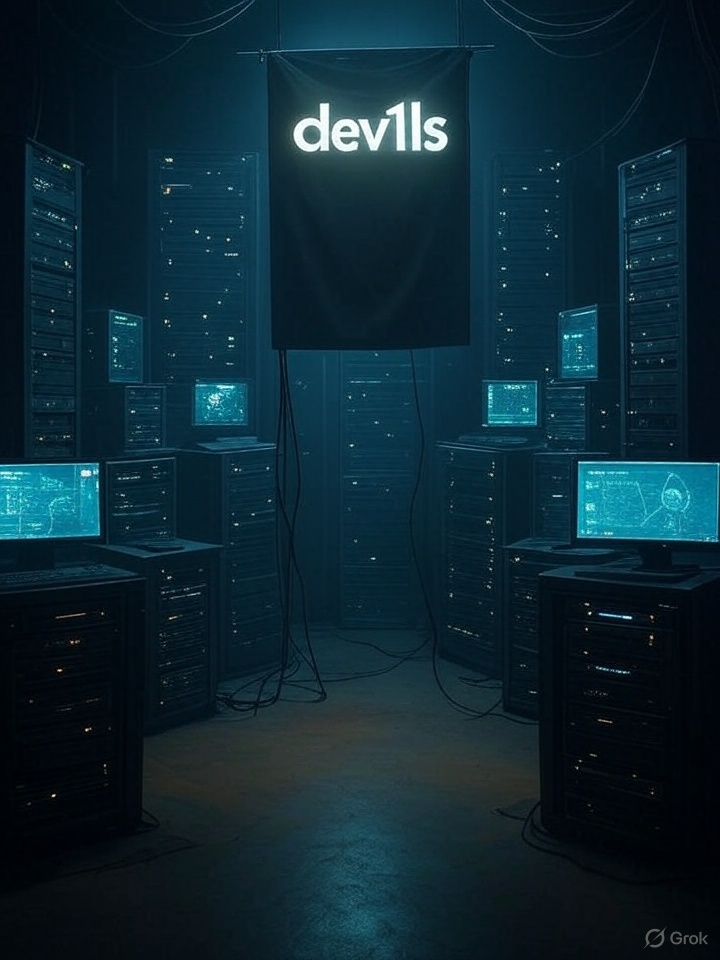

# Dev1ls ⚡

### in ❤️ with Unix | Spain 🇪🇸

---

#### 👋 **Sobre Mí**

🔭 **Actualmente estoy trabajando en mí mismo** [1] y enfocando mis energías en el crecimiento personal y profesional.
🌱 **Me encuentro aprendiendo React** [1], buscando expandir mis habilidades en el desarrollo frontend.
👯 **Estoy buscando colaborar en un proyecto grande y aprender de él** [1]. Me entusiasma la idea de unirme a equipos para abordar desafíos complejos y crecer juntos.
🤔 **Estoy buscando ayuda con un trabajo remoto** [1] en el ámbito de la tecnología. Abierto a nuevas oportunidades y desafíos.

---

#### 🗣️ **Hablemos de...**

💬 **Puede consultarme sobre Linux, *BSD o temas de backend** [1]. ¡Me encanta compartir conocimientos y discutir sobre estas áreas!

---

#### 🌐 **Conéctese Conmigo**

*   **Mi Blog Dev1ls:** [Dev1ls blog](https://dev1ls.deno.dev) [1, 5]
*   **Dev1ls Info:** [Dev1ls info](http:dev1ls.sdf.org) [1]
*   **Gopher:** [Gopher](gopher://texto-plano.xyz:70/1/~dev1ls/) [1]
*   **twtxt:** [twtxt](http://dev1ls.sdf.org/twt.html) [1]
*   **X (Twitter):** [@dev1lsconf](https://x.com/dev1lsconf) [5]
*   **Mastodon:** [@dev1ls@mastodon.sdf.org](https://mastodon.sdf.org/@dev1ls) [5]

---

#### ✨ **Proyectos Destacados**

Aquí puede destacar algunos de sus **"Repositorios"** [1]

*   **`nixos-config`**
    *   Nix [2]
    *   My NixOS Configuration [2]

*   **`blog`**
    *   unix/linux blog [1]

---

#### 😂 **Dato Curioso**

⚡ Fun fact: **¡Soy un tipo divertido! Créame, ja ja.** [1]

---

