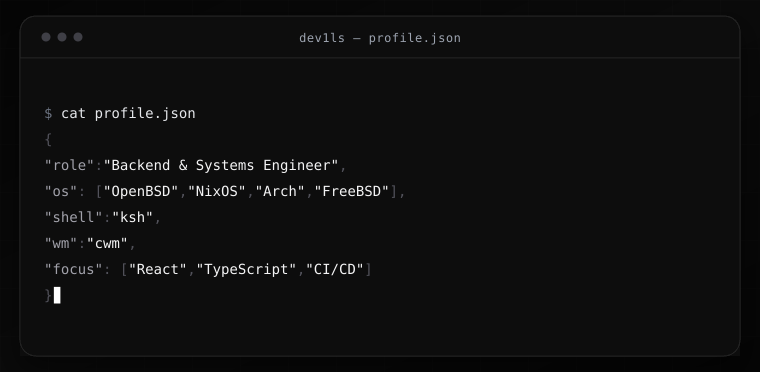
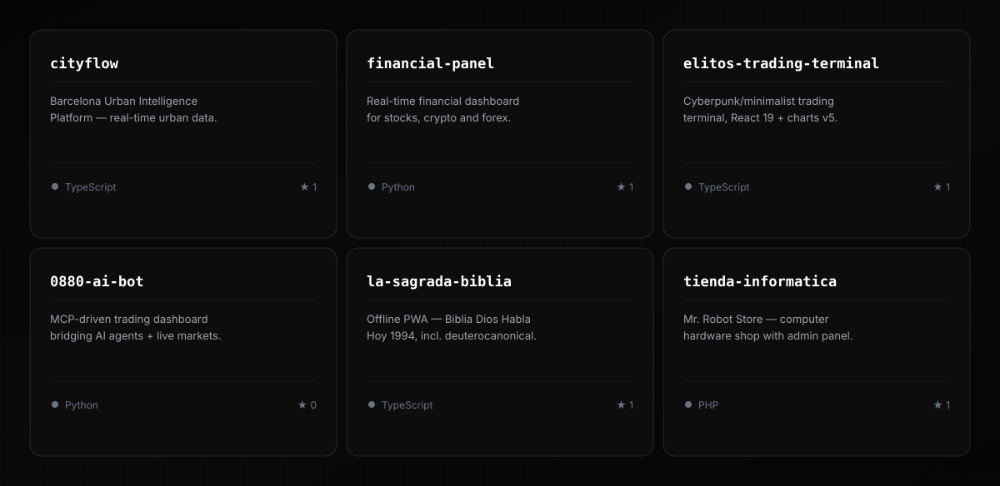
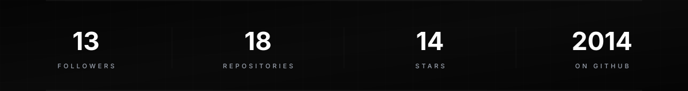

  

## Connect With Me

  
  
  
  

## About Me

Unix enthusiast and **backend & systems engineer** based in Spain. I build software guided by the Unix philosophy: simple, secure, and composable tools.

My work centers on backend development, systems administration, and infrastructure as code, with a strong commitment to OpenBSD security practices and declarative configuration.

Currently focusing on: <strong>React</strong> · <strong>TypeScript</strong> · <strong>CI/CD</strong> · <strong>Design Patterns</strong>

Open to collaborating on open-source systems, CLI/TUI tooling, and infrastructure.

Ask me about OpenBSD, Linux, NixOS, cwm, doas, Gemini, Gopher, and dotfiles.

**Available for remote work:** backend, systems, DevOps, SRE

## Technology Stack

### Operating Systems

  
  
  
  

### Shells & Scripting

  
  
  
  
  

### Window Managers

  
  
  
  

### Configuration & Security

  
  
  
  
  

### Protocols & Tools

  
  
  
  
  
  
  
  

## Featured Projects

  <a href="https://github.com/dev1lsconf?tab=repositories">View all repositories →</a>

## GitHub Stats

## Latest Blog Posts

<!--POSTS-START-->

27 Sep 2023 — <a href="http://dev1ls.sdf.org/blog/#gemini-vger-openbsd">vger + OpenBSD: Gemini server</a> · Gemini

19 Jul 2023 — <a href="http://dev1ls.sdf.org/blog/#my-cwm-openbsd">My cwm(1) dotfiles + lemonbar</a> · cwm

30 Jun 2023 — <a href="http://dev1ls.sdf.org/blog/#doas">Doas My Friends!</a> · Doas

18 Feb 2023 — <a href="http://dev1ls.sdf.org/blog/#cwm-window-manager">CWM Window Manager</a> · CWM

07 Feb 2023 — <a href="http://dev1ls.sdf.org/blog/#awesome-tui-apps">Awesome list TUI and CLI apps</a> · TUI/CLI

<!--POSTS-END-->

Updated automatically via GitHub Actions (daily at 06:00 UTC) — <a href="http://dev1ls.sdf.org/blog/">View all posts →</a>

## Philosophy

"Keep it simple, keep it secure, keep it Unix."

Simplicity · Security · Documentation · Openness

**Open to opportunities, collaborations, and technical conversations**

